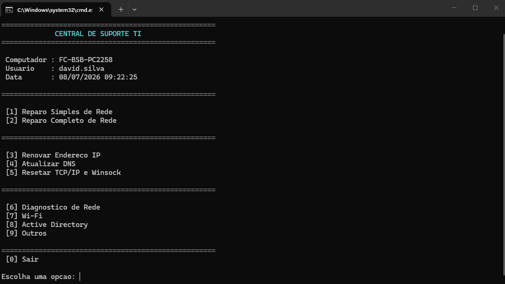
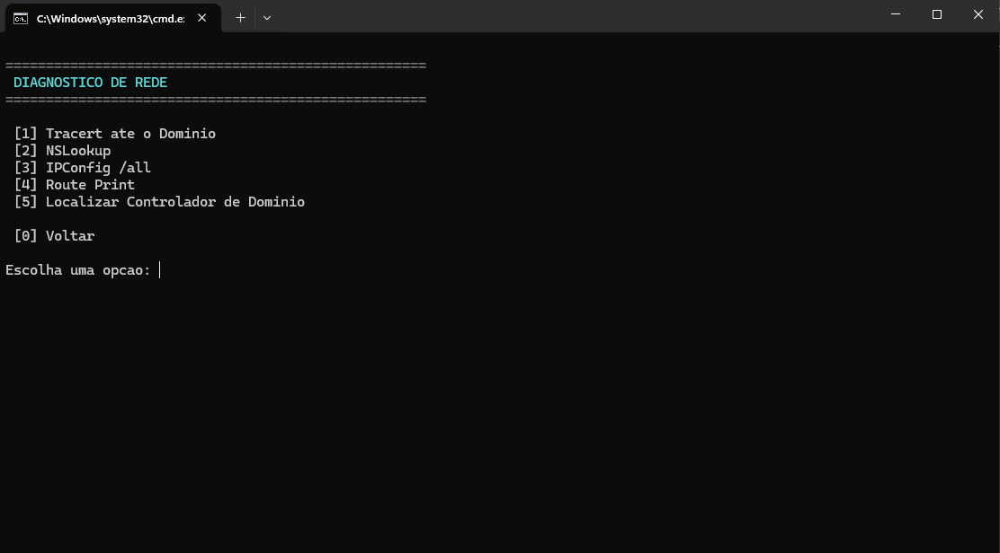
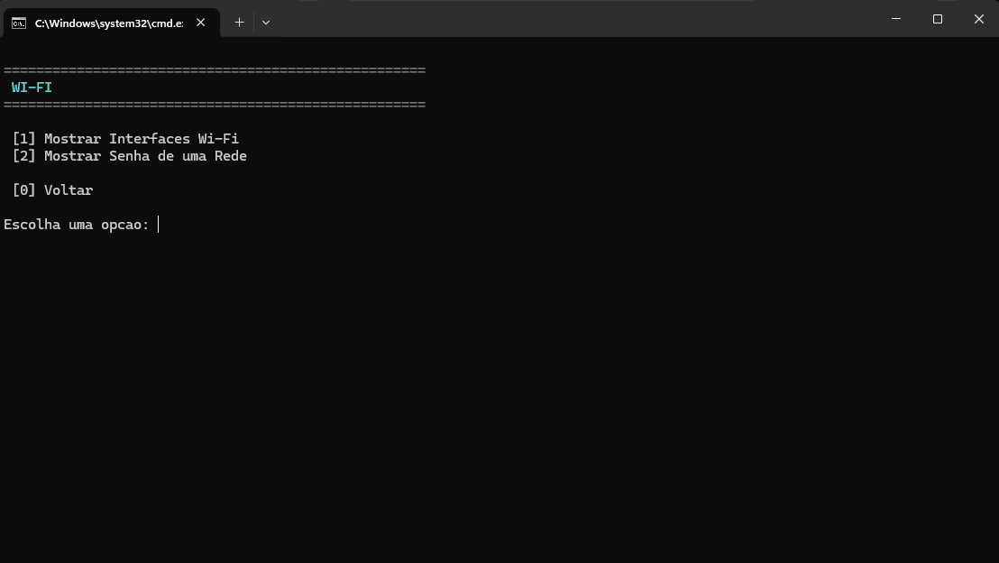
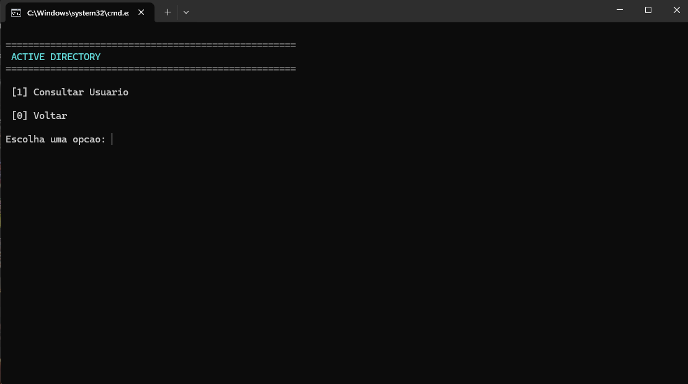

# 🛠 Central de Suporte TI

Script em PowerShell desenvolvido para automatizar tarefas recorrentes do suporte técnico em ambiente corporativo Windows.

---

## 📌 Objetivo

A Central de Suporte TI foi desenvolvida para ambientes Windows corporativos integrados ao Active Directory, centralizando em um único script PowerShell comandos de reparo, diagnóstico e administração para agilizar as rotinas da equipe de TI.

---

## 🚀 Funcionalidades

### 🔧 Reparo de Rede

- Reparo Simples (klist)
- Reparo Completo
- Renovação de IP
- Atualização de DNS
- Reset TCP/IP e Winsock

### 🌐 Diagnóstico

- Tracert
- NSLookup
- IPConfig /all
- Route Print
- Localizar Domain Controller

### 📶 Wi-Fi

- Interfaces
- Consulta de senha

### 👤 Active Directory

- Consulta de usuários

### ⚙ Outros

- Sincronização de Data e Hora

---

## 📷 Capturas

### Menu Principal

### Diagnóstico

### Wi-Fi

### Active Directory

---

## 💻 Tecnologias

- PowerShell
- Windows
- Active Directory
- DNS
- DHCP
- TCP/IP

---

## 🔮 Melhorias Futuras

- Interface gráfica (GUI)
- Registro de logs
- Integração com inventário
- Execução remota de comandos

---

## 👨‍💻 Autor

David Santos

Assistente de TI
